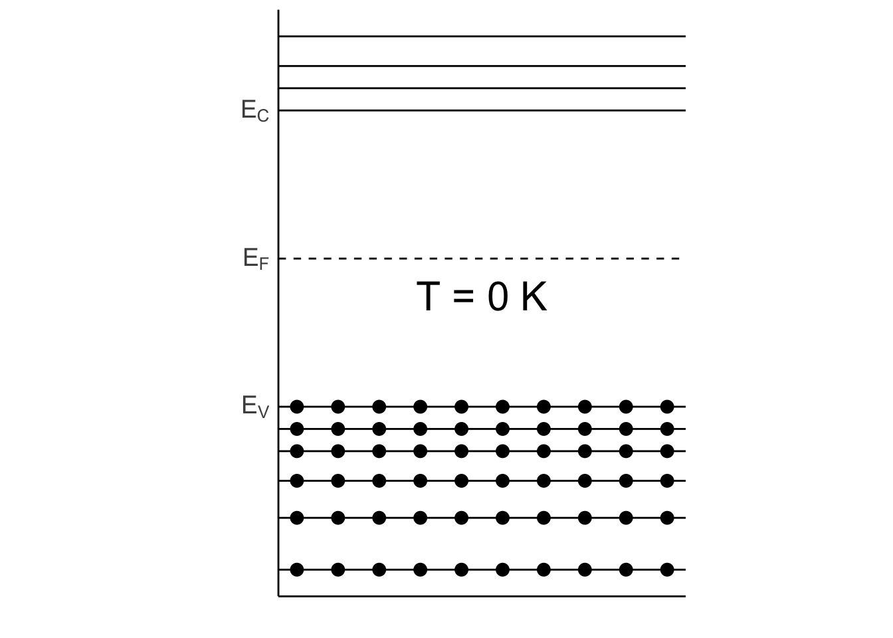
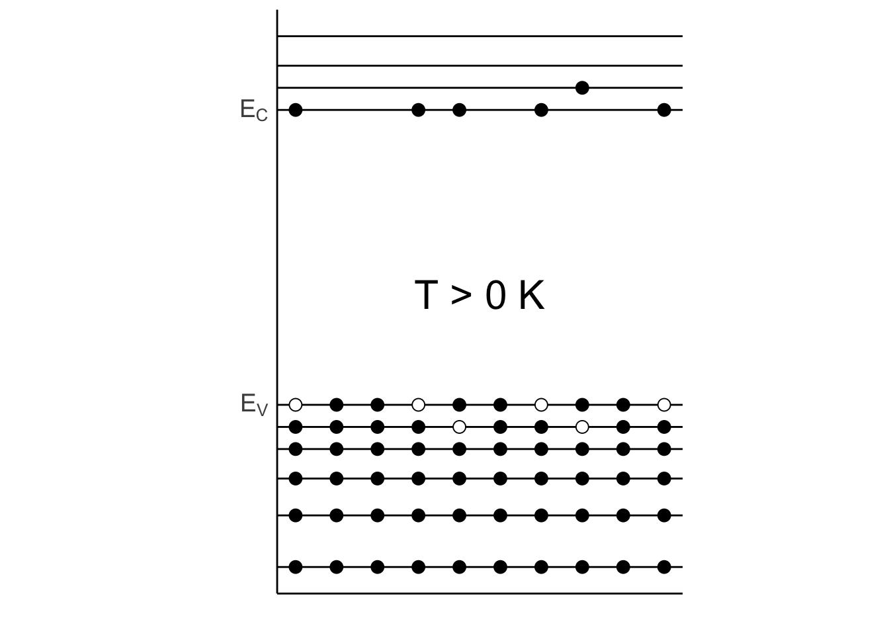
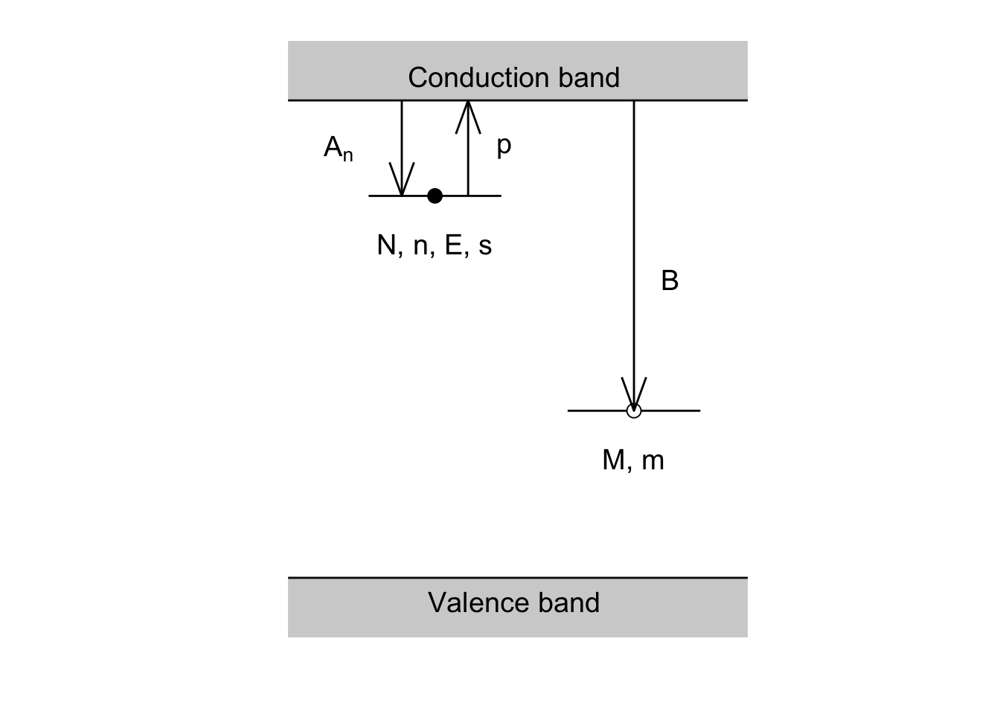
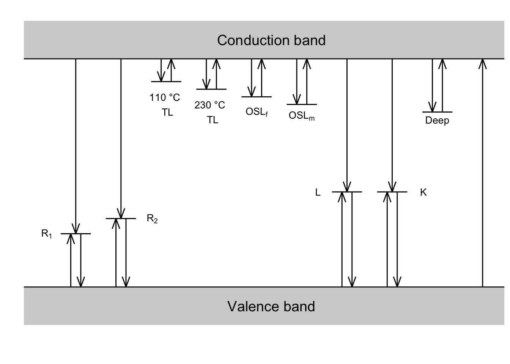

<!-- README.md is generated from README.Rmd. Please edit that file -->

[](http://www.repostatus.org/#active)

### Motivation

For my PhD I wanted a uniform design of my graphics. I used a lot of
energy-band models, so I decided to develop a graphical output with
[ggplot2](https://ggplot2.tidyverse.org). Here I present the usage for
anyone else who is interested in.

### Usage

First let´s load the needed packages:

``` r
library(scales)
library(ggplot2)

theme <- theme(axis.text = element_text(size = 14),
             axis.title = element_text(size = 14, face = "bold"),
             legend.text = element_text(size = 12),
             legend.title = element_text(size = 12, face = "bold"))
```

Let´s create a data.frame with the x and y coordinates of the electrons:

``` r
electrons <- data.frame(
  x = seq(0,1, length.out = 10),
  y = rep(c(-2.2,-1.5, -1, -0.6, -0.3, 0), each = 10)
)
```

Plot the energy-band diagram

``` r
ggplot(electrons) +
  ## add electrons
  geom_point(aes(x,y), size = 3) +
  
  ## add horizontal lines for energy levels
  geom_hline(yintercept = c(-2.2,-1.5, -1, -0.6, -0.3, 0, 4, 4.3, 4.6, 5)) +
  geom_hline(yintercept = 2, linetype = "dashed") +
  
  ## set the aspect ratio 
  coord_fixed(1/5) +
  
  ## disable x- and y-labels and ticks
  xlab("") +
  ylab("") +
  theme(axis.ticks = element_blank(),
        axis.text.x = element_blank()) +
  
  ## add labels on the y-axis
  scale_y_continuous(breaks = c(0, 2, 4), 
                     label = c(expression(paste(~E[V])),
                               expression(paste(~E[F])),
                               expression(paste(~E[C])))) +
  annotate("text", x = 0.5, y = 1.5, label = "T = 0 K", size = 8) +
    theme_classic() +
    theme(axis.ticks = element_blank(),
        axis.text.x = element_blank()) +
  theme
```



### More examples

Now we add electrons to the conduction band and holes are created in the
valence band.

``` r

electrons <- data.frame(
  x = seq(0,1, length.out = 10),
  y = rep(c(-2.2,-1.5, -1, -0.6, -0.3, 0), each = 10)
)
```

Plot the energy-band diagram

``` r
ggplot(electrons) +
  geom_hline(yintercept = c(-2.2,-1.5, -1, -0.6, -0.3, 0, 4, 4.3, 4.6, 5)) +
  geom_point(aes(x,y), 
             size = 3, 
             shape = 21,
             size = 3, 
             fill = c(rep("black", 44), "white", rep("black",2), "white", rep("black",2),
            "white" , "black","black","white", rep("black",2), "white",rep("black",2), "white"),
             show.legend = F) +
  geom_point(data = data.frame(
    x = c(0, 1/3, 4/9, 6/9, 7/9, 1),
    y = c(4, 4, 4, 4, 4.3, 4)
  ), aes(x,y), size = 3) + 
  coord_fixed(1/5) +
  xlab("") +
  ylab("") +
  theme(axis.ticks = element_blank(),
        axis.text.x = element_blank()) +
  scale_y_continuous(breaks = c(0, 4), 
                     label = c(expression(paste(~E[V])),
                               expression(paste(~E[C])))) +
  annotate("text", x = 0.5, y = 1.5, label = "T > 0 K", size = 8) +
  theme_classic() +
    theme(axis.ticks = element_blank(),
        axis.text.x = element_blank()) +
  theme
## Warning: Duplicated aesthetics after name standardisation: size
```



### Add energy levels in the band gap

``` r

e_trap <- data.frame(
  x = c(0/9, 2/9),
  y = c(4.2, 4.2)
)

recombination_centre <- data.frame(
  x = c(3/9, 5/9),
  y = c(2.4, 2.4)
)

arrow <- data.frame(
  x_start = c(0.5/9, 1.5/9, 4/9),
  x_end = c(0.5/9, 1.5/9, 4/9),
  y_start = c(5, 4.2, 5),
  y_end = c(4.2, 5, 2.4)
)

captured <- data.frame(
  x = c(1/9, 4/9),
  y = c(4.2, 2.4))

bands <- data.frame(
  x_start = c(-Inf, -Inf),
  x_end = c(Inf, Inf),
  y_start = c(0.5, 5.5),
  y_end = c(1, 5)
)
```

Plot the energy-band diagram

``` r
ggplot() +
  geom_hline(yintercept = c(1, 5)) +
  ## add donor state
  geom_line(data = e_trap, aes(x,y), show.legend = F) +
  ## add recombination state
  geom_line(data = recombination_centre, aes(x,y), show.legend = F) +
  ## add captured electrons and holes 
  geom_point(data = captured, 
             aes(x,y),
             shape = 21,
             size = 3, 
             fill =  c("black", "white"),
             show.legend = F) +
  geom_segment(data = arrow, mapping = aes(x = x_start, y = y_start, xend = x_end, yend = y_end),
               arrow = arrow(angle = 20)) +
  
  ## shaded area valence band
  geom_rect(data = bands,
            mapping = aes(xmin = x_start, ymin = y_start, xmax = x_end, ymax = y_end),
            alpha = .3) + 
  coord_fixed(1/5) +
  xlab("") +
  ylab("") +
  theme_classic() +
  
  ## add text in the plot
  annotate("text", x = 2.2/9, y = 5.2, label = "Conduction band", size = 5) +
  annotate("text", x = 2.2/9, y = 0.8, label = "Valence band", size = 5) +
  annotate("text", x = 4/9, y = 2, label = "M, m", size = 5) +
  annotate("text", x = 1/9, y = 3.8, label = "N, n, E, s", size = 5) +
  annotate("text", x = -0.5/9, y = 4.6, label = "~A[n]", size = 5, parse = TRUE) +
  annotate("text", x = 2/9, y = 4.6, label = "~p", size = 5, parse = TRUE) +
  annotate("text", x = 4.5/9, y = 3.5, label = "~B", size = 5, parse = TRUE) +
  xlim(c(-0.1, 0.6)) +
  theme +
  theme(axis.ticks = element_blank(),
        axis.line = element_blank(),
        axis.text = element_blank())
```



### More complex examples

Define the electrons and arrows

``` r

e_trap <- data.frame(
  x = c(6, 8, 9, 11,  12, 14, 15, 17, 24 , 26),
  y = rep(c(4.6, 4.4, 4.2, 4, 3.8)+1.8, each = 2),
  group = rep(1:5, each = 2)
)

recombination_centre <- data.frame(
  x = c(0, 2, 3, 5, 18, 20, 21, 23),
  y = rep(c(2.4, 2.8, 3.5, 3.5), each = 2),
  group = rep(1:4, each = 2)
)

arrow_RC_down <- data.frame(
  x_start = c(c(1, 4, 19, 22), c(1, 4, 19, 22) + 1/3),
  x_end = c(c(1, 4, 19, 22), c(1, 4, 19, 22) + 1/3),
  y_start = c(rep(7, 4), c(2.4, 2.8, 3.5, 3.5)),
  y_end = c(2.4, 2.8, 3.5, 3.5, rep(1,4))
)

arrow_RC_up <- data.frame(
  x_start = c(1, 4, 19, 22) - 1/3,
  x_end = c(1, 4, 19, 22) - 1/3,
  y_start = rep(1, 4),
  y_end = c(2.4, 2.8, 3.5, 3.5)
)

arrow_e_down <- data.frame(
  x_start = c(7,10,13,16,25) - 1/3,
  x_end = c(7,10,13,16,25) - 1/3,
  y_start = rep(7, 5),
  y_end = c(4.6, 4.4, 4.2, 4, 3.8) + 1.8
)

arrow_R <- data.frame(
  x_start = 28,
  x_end = 28,
  y_start = 1,
  y_end = 7
)

arrow_e_up <- data.frame(
  x_end = c(7,10,13,16,25) + 1/3,
  x_start = c(7,10,13,16,25) + 1/3,
  y_end = rep(7, 5),
  y_start = c(4.6, 4.4, 4.2, 4, 3.8) + 1.8
)

arrow <- dplyr::bind_rows(arrow_RC_up, arrow_RC_down,
                   arrow_e_down, arrow_e_up,
                   arrow_R)

bands <- data.frame(
  x_start = c(-Inf, -Inf),
  x_end = c(Inf, Inf),
  y_start = c(0, 8),
  y_end = c(1, 7)
)
```

Plot the energy-band diagram

``` r
ggplot() +
  geom_hline(yintercept = c(1, 7)) +
  ## add donor state
  geom_line(data = e_trap, aes(x,y, group = group), show.legend = F) +
  ## add recombination state
  geom_line(data = recombination_centre, aes(x,y, group = group), show.legend = F) +

  geom_segment(data = arrow, mapping = aes(x = x_start, y = y_start, xend = x_end, yend = y_end),
               arrow = arrow(angle = 20,
                             length = unit(0.15, "inches"))) +
  
  ## shaded area valence band
  geom_rect(data = bands,
            mapping = aes(xmin = x_start, ymin = y_start, xmax = x_end, ymax = y_end),
            alpha = .3) + 
  xlab("") +
  ylab("") +
  theme_classic() +
  
  ## add text in the plot
  annotate("text", x = 14, y = 7.5, label = "Conduction band", size = 5) +
  annotate("text", x = 14, y = 0.5, label = "Valence band", size = 5) +
  annotate("text", x = -1, y = 2.4, label = "~R[1]", size = 3.5, parse = T) +
  annotate("text", x = 6, y = 2.8, label = "~R[2]", size = 3.5, parse = T) +
  annotate("text", x = 17, y = 3.5, label = "~L", size = 3.5, parse = T) +
  annotate("text", x = 24, y = 3.5, label = "~K", size = 3.5, parse = T) +
  annotate("text", x = 7, y = 5.8, label = "110 °C \n TL", size = 3.5) +
  annotate("text", x = 10, y = 5.6, label = "230 °C \n TL", size = 3.5) +
  annotate("text", x = 13, y = 5.6, label = "OSL[ f]", size = 3.5, parse = T) +
  annotate("text", x = 16, y = 5.5, label = "OSL[ m]", size = 3.5, parse = T) +
  annotate("text", x = 25, y = 5.4, label = "Deep", size = 3.5) +
  theme +
  theme(axis.ticks = element_blank(),
        axis.line = element_blank(),
        axis.text = element_blank())
```


